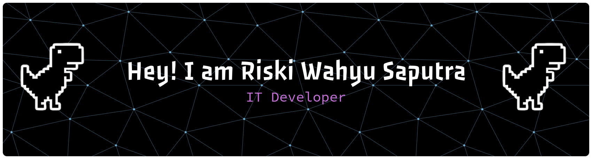

<div align="center">
  <a href="https://github.com/RiskiWahyuSaputra">
    
  </a>
</div>

<div align="center">
  
</div>

<div align="center">
  
</div>

## 👨‍💻 About Me

```js
const riski = {
  role:     "Fullstack Web Developer",
  code:     ["JavaScript", "TypeScript", "PHP", "SQL"],
  stack:    ["Next.js", "React", "Laravel", "CodeIgniter", "Tailwind"],
  tools:    ["Git", "GitHub", "MySQL", "Ubuntu"],
  learning: "Next.js + TypeScript at scale",
  motto:    "Ship it, then make it better ⚡",
};
```

- 🔭 Building web apps with **Laravel** and **Next.js**
- 🌱 Currently deep-diving **TypeScript** and modern React patterns
- 👯 Open to collaborate on **open source** and freelance web projects
- 💬 Ask me about **PHP, Laravel, React, or Linux**
- 📫 Reach me on [Instagram](https://www.instagram.com/arskies_/) or [LinkedIn](https://www.linkedin.com/in/riski-wahyu-saputra-6a9078294/)

## 🛠️ Tech Skills

**Frontend**


**Backend & Database**


**Tools & Environment**


## 📊 GitHub Stats

<div align="center">
  
  
</div>

<div align="center">
  
</div>

<div align="center">
  
</div>

## 🌐 Connect with me

<div align="center">

[](https://www.instagram.com/arskies_/)
[](https://www.linkedin.com/in/riski-wahyu-saputra-6a9078294/)
[](https://github.com/RiskiWahyuSaputra)

</div>

## 🎮 Contribution Graph

<picture>
  <source media="(prefers-color-scheme: dark)" srcset="https://raw.githubusercontent.com/RiskiWahyuSaputra/RiskiWahyuSaputra/output/pacman-contribution-graph-dark.svg">
  <source media="(prefers-color-scheme: light)" srcset="https://raw.githubusercontent.com/RiskiWahyuSaputra/RiskiWahyuSaputra/output/pacman-contribution-graph.svg">
  
</picture>

<div align="center">
  <br>
  <i>⭐ From <a href="https://github.com/RiskiWahyuSaputra">RiskiWahyuSaputra</a></i>
</div>
