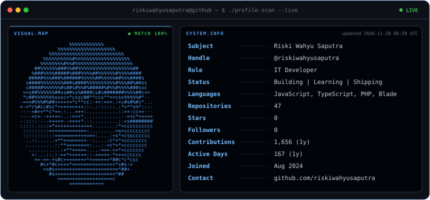
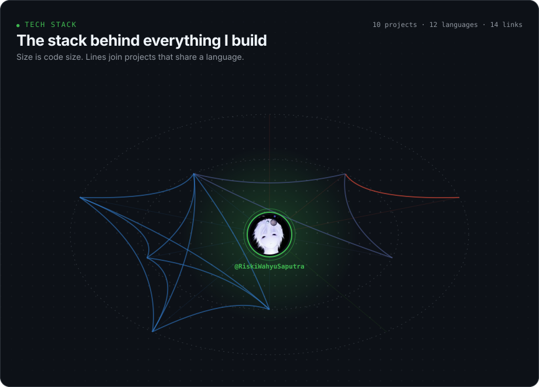
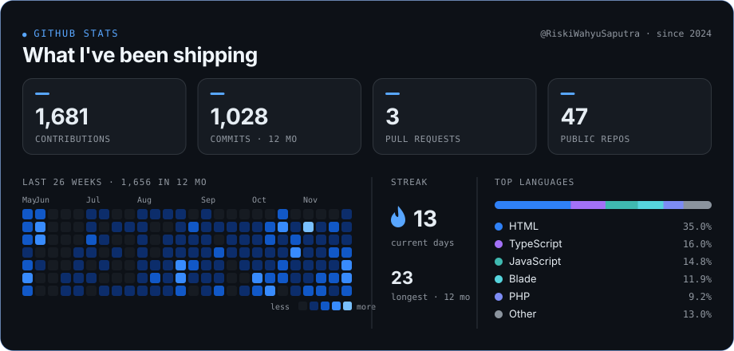
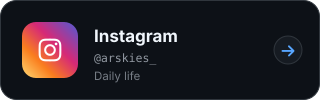
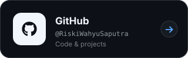
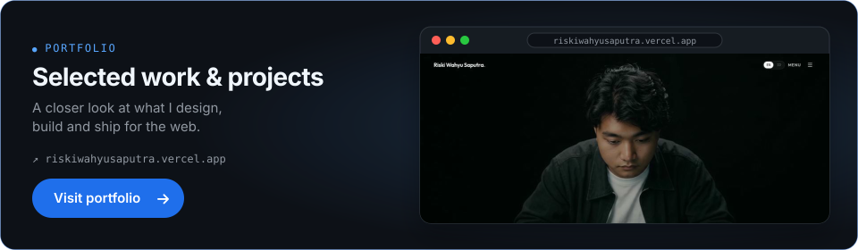

<p align="center">
<picture>
  <source media="(prefers-color-scheme: light)" srcset="https://raw.githubusercontent.com/RiskiWahyuSaputra/RiskiWahyuSaputra/system-scan/profile-scan-light.svg" />
  
</picture>
</p>

<div align="center">
  <a href="https://github.com/RiskiWahyuSaputra">
    
  </a>
</div>

<div align="center">
  
</div>

<div align="center">
  
</div>

<div align="center">


</div>

## 👨‍💻 About Me

```js
const riski = {
  role:     "IT Developer",
  code:     ["JavaScript", "TypeScript", "PHP", "SQL"],
  stack:    ["Next.js", "React", "Laravel", "CodeIgniter", "Tailwind"],
  tools:    ["Git", "GitHub", "MySQL", "Linux", "Ubuntu"],
  learning: "Next.js + TypeScript at scale",
  motto:    "Ship it, then make it better ⚡",
};
```
<picture>
  <source media="(prefers-color-scheme: light)" srcset="https://raw.githubusercontent.com/RiskiWahyuSaputra/RiskiWahyuSaputra/system-scan/tech-stack-light.svg" />
  
</picture>

<picture>
  <source media="(prefers-color-scheme: light)" srcset="https://raw.githubusercontent.com/RiskiWahyuSaputra/RiskiWahyuSaputra/system-scan/tech-stack-legend-light.svg" />
  
</picture>

<div align="center">
<table>
  <tr>
    <th align="center">🎨 Frontend</th>
    <th align="center">⚙️ Backend &amp; Database</th>
    <th align="center">🛠️ Tools &amp; Environment</th>
  </tr>
  <tr>
    <td align="center"></td>
    <td align="center"></td>
    <td align="center"></td>
  </tr>
  <tr>
    <td align="center"><sub>HTML · CSS · JavaScript · TypeScript<br>React · Next.js · Tailwind</sub></td>
    <td align="center"><sub>PHP · Laravel<br>CodeIgniter · MySQL</sub></td>
    <td align="center"><sub>Git · GitHub · VS Code<br>Linux · Ubuntu</sub></td>
  </tr>
</table>
</div>

## 💡 Random Dev Quote

<div align="center">
  
</div>

## 📊 GitHub Stats

<picture>
  <source media="(prefers-color-scheme: light)" srcset="https://raw.githubusercontent.com/RiskiWahyuSaputra/RiskiWahyuSaputra/system-scan/github-stats-light.svg" />
  
</picture>

## 🎵 Now Playing

<div align="center">
  <a href="https://open.spotify.com/user/31ashwdrxyilecvdrfqzsq7mr7sm">
    <picture>
      <source media="(prefers-color-scheme: light)" srcset="https://raw.githubusercontent.com/RiskiWahyuSaputra/RiskiWahyuSaputra/now-playing/now-playing-light.svg" />
      
    </picture>
  </a>
</div>

## 🌐 Connect with me

<p align="center">
  <a href="https://www.instagram.com/arskies_/"><picture>
    <source media="(prefers-color-scheme: light)" srcset="img/connect/instagram-light.svg" />
    
  </picture></a>
  <a href="https://www.linkedin.com/in/riski-wahyu-saputra-6a9078294/"><picture>
    <source media="(prefers-color-scheme: light)" srcset="img/connect/linkedin-light.svg" />
    
  </picture></a>
  <a href="https://github.com/RiskiWahyuSaputra"><picture>
    <source media="(prefers-color-scheme: light)" srcset="img/connect/github-light.svg" />
    
  </picture></a>
</p>

## 🚀 Portfolio

<a href="https://portofolio-sigma-three-87.vercel.app/"><picture>
  <source media="(prefers-color-scheme: light)" srcset="img/connect/portfolio-light.svg" />
  
</picture></a>

## 🎮 Contribution Graph

<p align="center">
<picture>
  <source media="(prefers-color-scheme: light)" srcset="https://raw.githubusercontent.com/RiskiWahyuSaputra/RiskiWahyuSaputra/output/pacman-contribution-graph.svg" />
  
</picture>
</p>

<div align="center">
  <br>
  <i>⭐ From <a href="https://github.com/RiskiWahyuSaputra">RiskiWahyuSaputra</a></i>
</div>

<div align="center">
  
</div>
